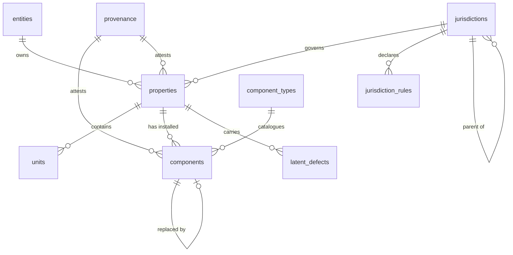
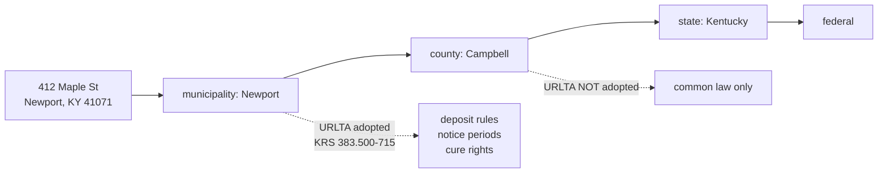
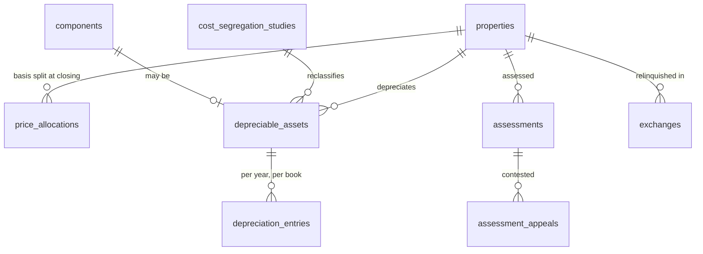
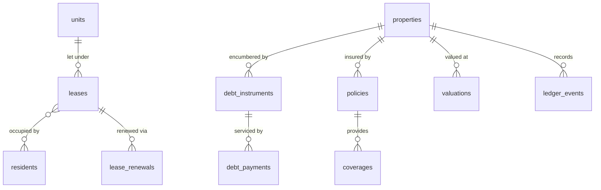
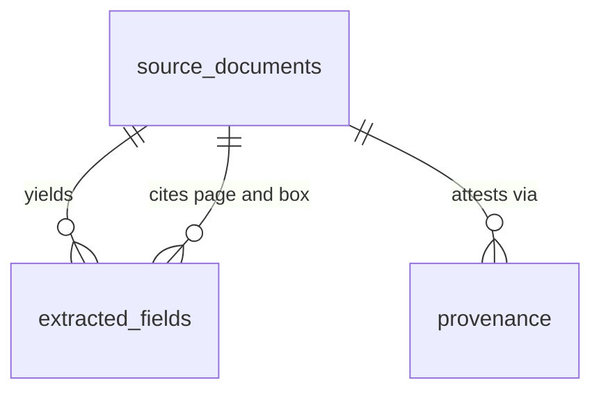

# The Hestia ledger

PostgreSQL 17. Six modules, 34 tables, 49 named check constraints, 9 domains,
64 foreign keys and 13 triggers. Applied and constraint-tested against a real
server on every push (`scripts/verify-schema.sh`, and the `schema` job in CI).

```
001_foundations.sql          money, provenance, entities, jurisdictions, rules
002_property.sql             properties, units, components, latent defects
003_leasing_and_debt.sql     residents, leases, renewals, notes, payments
004_tax.sql                  allocation, dual-book depreciation, appeals, 1031
005_risk_ledger_documents.sql insurance, valuation, the ledger, extraction
006_integrity.sql            triggers: updated_at, append-only, versioned rules
```

---

## Four decisions that shape everything

### 1. Money is never a float

Every monetary column is `NUMERIC(18,2)` through the `money_amount` domain. The
application layer holds the same values as integer minor units behind a branded
`Money` type, and the two representations must agree exactly. A cent lost to
binary rounding is a cent that reappears in a tax filing.

Rates are a separate domain, `rate_decimal` — `NUMERIC(12,8)`, carrying a daily
periodic rate without drift across a 360-month term. The type system refuses to
add one to a dollar amount.

### 2. Every fact carries its provenance

The product's central promise is that the owner **corrects** rather than
**enters**. That is only honest if the interface can show where each value came
from and how sure the system is:

```sql
CREATE TYPE provenance_kind AS ENUM (
  'owner_stated', 'document', 'public_record', 'market_data', 'inferred', 'default'
);
```

Two constraints keep it truthful:

```sql
CONSTRAINT stated_facts_are_certain
  CHECK (kind <> 'owner_stated' OR confidence = 1.0),
CONSTRAINT inferences_explain_themselves
  CHECK (kind <> 'inferred' OR derived_from IS NOT NULL)
```

*An inference the system cannot explain is one the owner cannot check.*

### 3. Rules and facts are effective-dated

`jurisdiction_rules` is bitemporal by construction: `effective_from`/
`effective_to` is when a rule was true in the world; `recorded_at` is when we
learned it. `ledger_events` is the same, and append-only — a correction is a new
row referencing the one it reverses, never an update.

Both are needed to answer *"what did we believe on the day we filed"*, which is
the question that arrives with an audit letter.

`depreciation_entries.law_as_of` records which vintage of the code produced each
figure. Without it, a restatement is indistinguishable from an error.

### 4. Renters are `residents`

In the surrounding platform `tenant` means *workspace*. The collision is settled
here permanently in favour of clarity: no table, column, type or constraint is
named for it. The word survives only inside prose, in the legal term of art
"landlord-tenant", where no other phrase would do.

---

## The asset and its components



**`components` is the structure no competitor keeps.** Every incumbent asks the
owner to type in forty install dates they do not know, so the table stays empty
and the capital plan stays a guess. Hestia infers the inventory at onboarding
from vintage, permit history and regional norms, and records how sure it is:

```sql
installed_on        DATE,          -- when it is actually known
installed_year_low  SMALLINT,      -- the credible band when it is not
installed_year_high SMALLINT,
provenance_id       UUID NOT NULL, -- mandatory on this table alone

CONSTRAINT install_known_or_bounded
  CHECK (installed_on IS NOT NULL OR installed_year_low IS NOT NULL)
```

An inferred roof age with a ten-year band forecasts better than no roof at all.

`component_types` carries Weibull shape and scale, so the capital engine can
Monte Carlo ten years forward rather than assuming a flat reserve per unit per
year. It also carries `causes_water_damage`: a failed tank water heater is the
leading source of interior water-loss claims, and its replacement cost bears no
relation to its failure cost.

**`latent_defects`** covers what is risk rather than wear — lead paint before
1978, asbestos before 1980, aluminium branch wiring 1965–73, Orangeburg sewer
1945–72, Federal Pacific Stab-Lok panels, polybutylene supply. Each row records
all four consequences at once (`affects_safety`, `affects_insurance`,
`affects_financing`, `triggers_disclosure`), because owners meet them one at a
time, at the worst moment.

---

## Jurisdiction resolution



Kentucky is the motivating case and the reason this is a hierarchy rather than a
column. URLTA binds only the roughly nineteen governments that formally adopted
it. Newport, Bellevue, Dayton, Southgate and Silver Grove are covered; **the
unincorporated remainder of Campbell County is not.** A property one street
across a city line has different deposit rules, notice periods and cure rights.

Resolution walks municipality → county → state → federal (one shared SQL
function, `jurisdiction_chain()`) and takes the most specific rule in force on
the date in question. Every rule carries a `citation`, because a rule without
one is an opinion.

**States are data packs** (ADR 0003; `seed/README.md`). The cross-river pair
shows the whole design in one metro: from the same query, a Newport KY
property resolves `appeal.window.calendar = 'us-ky.open-inspection'`
(first Monday of May + 13 days excluding Sundays, PVA conference required —
KRS 133.045/133.120, 100% assessment ratio, frozen-2001 depreciation
conformity), while a Cincinnati OH property one bridge away resolves
`'us-oh.bor-complaint'` (DTE Form 1 with the county auditor, January 1 –
March 31, no conference — ORC 5715.19, 35% ratio, 2/3-addback conformity
over six years). A state with no pack resolves to *nothing*, and the sweep
reports a typed coverage gap instead of guessing.

---

## Dual-book depreciation

The load-bearing idea in the tax module, and the thing no consumer tool models.

OBBBA (P.L. 119-21, 4 July 2025) restored 100% bonus depreciation permanently
for property placed in service after 19 January 2025. **Kentucky did not
follow.** It requires an IRC §168(k) add-back and computes state depreciation
under §168 as in effect on **31 December 2001**.

So a cost segregation study delivers the entire federal benefit and *nothing* in
Kentucky, and the two schedules never reconverge for the life of the asset.
Reporting a single depreciation number to a Kentucky owner is not a
simplification — it is wrong.



One row per asset **per book**:

```sql
book            tax_book NOT NULL,   -- 'federal' | 'state' | 'amt' | 'book'
jurisdiction_id UUID,                -- which state, when book = 'state'

CONSTRAINT state_assets_name_their_state
  CHECK (book <> 'state' OR jurisdiction_id IS NOT NULL)
```

`bonus_percent` is stored rather than derived, because the rate is a function of
the placed-in-service date under law that has changed repeatedly. A schedule
recomputed under today's rules would silently restate prior filings.

### Purchase price allocation

```sql
CONSTRAINT allocation_sums_to_basis
  CHECK (land_value + improvement_value + personal_property = total_basis)
```

One careless line at closing sets the depreciation life of the asset forever.
Land is never depreciable, so every dollar parked there is a dollar of deduction
surrendered for the whole hold — and the split is routinely made by copying
whatever ratio the assessor happened to publish.

### Statutory clocks as constraints

```sql
CONSTRAINT identification_window_is_45_days
  CHECK (identify_by = closed_relinquished_on + 45),
CONSTRAINT acquisition_window_within_180_days
  CHECK (acquire_by > closed_relinquished_on
         AND acquire_by <= closed_relinquished_on + 180),
CONSTRAINT shortened_window_says_why
  CHECK (acquire_by = closed_relinquished_on + 180 OR acquire_by_reason IS NOT NULL)
```

The identification clock is arithmetic, so a mistyped 45-day deadline cannot be
saved at all. The replacement clock is *bounded* rather than fixed, because IRC
§1031(a)(3)(B) sets it at the **earlier of** 180 days or the due date of the
return for the year of the transfer — for a late-year closing the true deadline
falls short of 180 days, and an equality check admitted only the wrong date. A
shortened window is allowed and must record `acquire_by_reason`.

### The appeal window

`assessment_appeals` models what most owners never see. Kentucky's open
inspection period opens on the **first Monday in May for thirteen days**
(KRS 133.045), and a conference with the PVA (Form 62A307) must precede any
filing with the County Clerk. A successful appeal compounds across the entire
remaining hold, which makes it the highest-return hour an owner can spend.

Deferred maintenance is admissible evidence — so `components` feeds this
directly.

---

## Leasing, debt, risk



**Disposal, not deletion.** The ledger and the tax books restrict a property's
deletion rather than cascading from it: history outlives the asset, and
ownership ends with `properties.disposed_on`. A property entered in error, before
any money has moved, still deletes cleanly and takes its units, leases,
components and renewal offers with it.

**`lease_renewals`** stores every offer, its outcome, and the cost of the ones
refused (`vacancy_days`, `turn_cost`). This is what calibrates
`P(leave | increase)` from the portfolio itself rather than from a market
average describing somebody else's building.

**`debt_instruments.prepayment`** — yield maintenance and defeasance can cost
more than the interest a refinance saves. A recommendation that ignores exit
friction is worse than none. `has_due_on_sale` exists because owners transfer
property into an LLC for liability protection without reading the clause.

**`coverages`** separates flat from percentage deductibles (wind and hail are
usually a percentage of the dwelling limit, which is a materially larger
exposure than owners carry in their heads) and records `months_covered` for loss
of rents, which is routinely shorter than a real rebuild.
`policies.has_ordinance_and_law` is the gap that bankrupts owners of older
buildings: after a loss, code compels rebuilding to current standards, and a
policy without the endorsement pays only to restore what was there.

---

## Document extraction

The seam is lifted wholesale from `healthcare-poc`: the problem is identical and
only the nouns change — settlement statements, leases, declaration pages and
assessment notices instead of clinical records.



Every field carries a `confidence`, a `page` and a `bounding_box`. Low
confidence sets `needs_review` and routes to a human rather than into the
ledger. `source_documents` is content-addressed on `sha256`, so re-uploads
deduplicate.

This is what makes *"the owner corrects, never enters"* an honest claim rather
than a slogan: the machine shows its work, and the correction is one interaction
instead of a form.

---

## Verification

```bash
./scripts/verify-schema.sh          # podman/docker locally, postgres service in CI
```

Applies all six modules to a real PostgreSQL, then runs
`schema/tests/constraints.sql` — 44 assertions, 31 of which plant a deliberate
violation and require the schema to reject it **by name**:

```
ok  rejected by allocation_sums_to_basis: an allocation whose parts do not sum to the basis
ok  rejected by identification_window_is_45_days: a 45-day window typed as 60 days
ok  rejected by land_is_not_depreciated: land marked as depreciable
ok  rejected by annual_rate_check: an interest rate typed in percent form
ok  rejected by rising_hazard: a falling hazard, which no catalogued component has
ok  rejected by <trigger>: an update to the ledger
ok  rejected by ledger_events_property_id_fkey: deleting a property with ledger history
...
```

Naming the constraint is the point. A helper that accepts *any* rejection
certifies constraints that may have been dropped, mistyped, or never created —
a row refused by an unrelated `NOT NULL` reported success just as loudly. The
harness proves this about itself: two cases deliberately expect the wrong
constraint and require the helper to fail them.

The runner also counts assertions and refuses to report success if fewer ran
than the file declares, and it verifies that `000_all.sql` includes every
numbered module — a check added after 006 was written, omitted from the
manifest, and silently not applied while the suite stayed green.

A constraint that has never been shown to reject anything is a comment.

---

*Nothing here is tax or legal advice. The schema's job is to compute, cite, and
surface the deadline — a qualified professional's review is the other half.*
